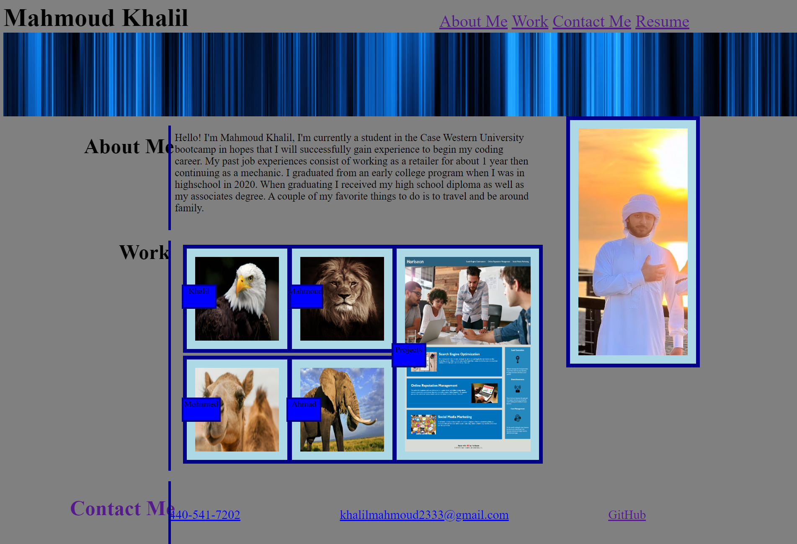

# Mahmoud-Portfolio

This is my first assignment I have done starting from scratch and it was my Portfolio. I have done the following
    - I have an About Me, Work, and Contact Me button that takes you right where you have to be. 
    - In the About Me section I have mentioned a couple things about myself and hobbies of mine.
    - In my Work section I have posted my first assignment, which was debugging/reconstructing a code. The rest are temporarily placeholders.
    - My Contact Me section has my phone number, my email, and my GitHub.
    - I have posted an image of myself.

## Screenshot

### Deployed Application

https://github.com/MHKhalil1/Mahmoud-Portfolio